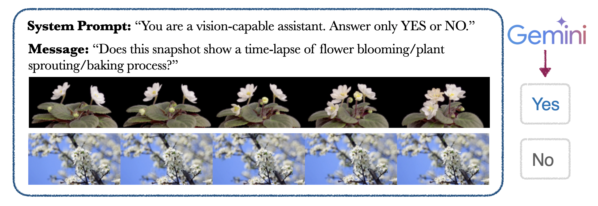
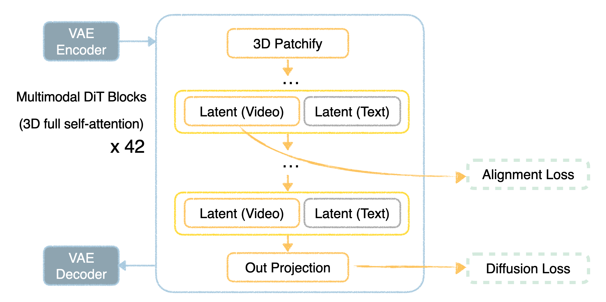
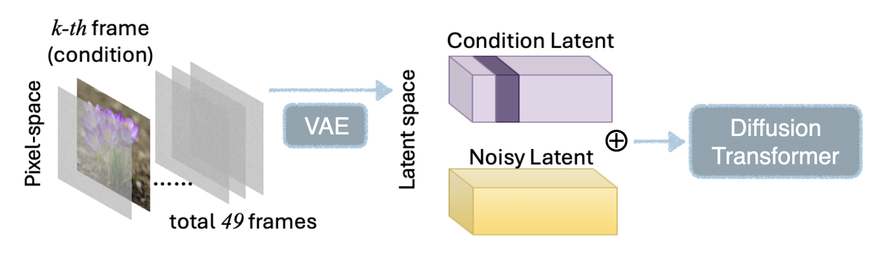
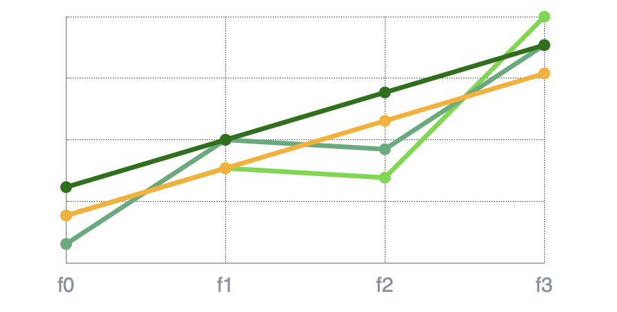
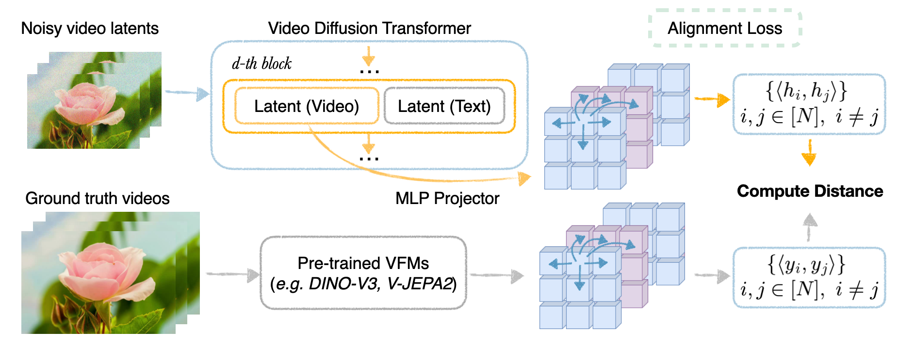

<figure style="max-width: 960px; margin: 0 auto; text-align: center;">
  <video
    src="assets/videos/output_cropped.mp4"
    autoplay
    muted
    loop
    playsinline
    style="width:100%; height:auto; display:block; border-radius:0px; background:#000;">
    Sorry—your browser doesn’t support embedded videos.
  </video>
  <figcaption style="margin-top:8px; font-size:0.95rem; color:#666;">
    Conditioned on a single input image at a specified point in time, our model generates timelapse video content before and/or after the keyframe while preserving subject consistency.
  </figcaption>
</figure>

## Overview
Long-range coherence is a key problem in image to video generation. Unlike text-to-video cases, conditioning on an input image imposes the greater challenge of faithfully maintaining image content, often requiring a model to understand semantics and geometry in order to avoid unnatural morphing and sudden substitutions. Advancing long-range coherence to handle hundreds or thousands of frames would unlock new applications in world modeling, simulation, and interactive agents. 

Some methods aim to extend temporal duration by stitching short clips together---often autoregressively---while trying to maintain the alignment of subjects and scenes<d-cite key="henschel2025streamingt2v"></d-cite><d-cite key="zhang2025packing"></d-cite>. This works well when the clips are self-consistent, but it can amplify compounding mistakes when they are not. 

A potential alternative would be to generate a fast-forward (i.e., timelapse) version of long video as a single clip, and then to use inbetweening and interpolation to create finer temporal details. This approach is becoming more feasible thanks to video generation backbones that can produce clips with around 50--90 frames in a single pass. 

This raises the question: **Can existing image-to-video models generate convincing long-horizon content within a single clip?** To study this, we focus on generating timelapse videos, which compress hours or days of change (plant growth, dough proofing, melting, etc.) into seconds. Subject appearance and geometry can evolve substantially during a timelapse video, so success requires the ability to model physically plausible transitions and stable long-horizon dependencies. This makes image-to-timelapse generation a convenient benchmark for improving long-horizon consistency in general. 

We show that current models often fail when generating timelapse clips, and we introduce an alignment technique that leads to improvements. Our technique is called *first-order representation alignment (dREPA)*, and it builds on the representation alignment scheme of Yu et al.<d-cite key="yu2024representation"></d-cite> and Zhang et al.<d-cite key="zhang2025videorepa"></d-cite>. It is a simple training-time regularizer that improves subject consistency in timelapse videos across a range of artistic and photo-realistic styles. Alignment with dREPA can help generate content that substitutes for the laborious process of capturing real timelapse videos.

### How do existing methods fail?

There has been relatively little work on generating timelapse videos. The closest we know is MagicTime<d-cite key="yuan2025magictime"></d-cite>, a text-to-video method that turns detailed prompts into short 16-frame clips. It is effective for stylized, cartoon-like outputs but is not designed for image conditioning or photorealistism.

We tested some current image-to-video models <d-cite key="ren2024consisti2v"></d-cite><d-cite key="yang2024cogvideox"></d-cite><d-cite key="kong2024hunyuanvideo"></d-cite><d-cite key="zhang2025packing"></d-cite> on timelapse generation, and we observed two main types of failures:

1. <strong>Limited shape dynamics</strong>:
The generated content is largely static, failing to realize continuous deformations like a blooming flower or rising bread.

2. <strong>Lack of subject consistency</strong>:
There are sudden appearance shifts,  with abrupt, irrelevant substitutions, even in a strong model like Veo3.

<style>
  .block {
    max-width: 1100px;   /* adjust overall width */
    margin: 0 auto;
  }
  .block h3 {
    text-align: center;
    font-size: 1.05rem;
    margin: 0.4rem 0 0.6rem 0;  /* tight vertical spacing */
    line-height: 1.2;
  }
  .two-vids {
    display: flex;
    gap: 10px;           /* space between the two videos */
    align-items: flex-start;
  }
  .two-vids figure {
    flex: 1 1 0;
    margin: 0;           /* remove default figure margins */
  }
  .two-vids video {
    height: clamp(130px, 25vw, 130px); /* shared height */
    width: auto;                       /* let width vary */
    object-fit: cover;                 /* fills height; may crop sides */
    background: #000;
    border-radius: 10px;
    display: block;
  }
  .two-vids figcaption {
    text-align: center;
    font-size: 0.9rem;
    color: #666;
    margin-top: 4px;
  }

  /* Optional: stack on narrow screens */
  @media (max-width: 720px) {
    .two-vids { flex-direction: column; }
  }
</style>

<section class="block">
  <h3>Failure case 1. Limited <span style="color:#FFB703;">Shape Dynamics</span></h3>
  <div class="two-vids">
    <figure>
      <video src="assets/videos/consistI2V.mp4" autoplay loop muted playsinline></video>
      <figcaption>ConsistI2V</figcaption>
    </figure>
    <figure>
      <video src="assets/videos/hunyuan_peony.mp4" autoplay loop muted playsinline></video>
      <figcaption>Hunyuan Video</figcaption>
    </figure>
  </div>
</section>

<section class="block">
  <h3>Failure case 2. Lack of <span style="color:#8ECAE6;">Subject Consistency</span></h3>
  <div class="two-vids">
    <figure>
      <video src="assets/videos/veo3_almond.mp4" autoplay loop muted playsinline></video>
      <figcaption>Veo3</figcaption>
    </figure>
    <figure>
      <video src="assets/videos/cog_peony.mp4" autoplay loop muted playsinline></video>
      <figcaption>CogVideoX (base)</figcaption>
    </figure>
  </div>
</section>

<br>

These failure cases highlight the core challenge of timelapse and in general long-range video generation: **achieving meaningful progression over time while preserving subject identity and scene layout**.

### Our approach
We show that we can improve both shape dynamics and subject consistency with our proposed training-time regularization method dREPA. Besides learning better first-order spatio-temporal dynamics, a key advantage of dREPA is that it only applies during training and so does not affect inference time. We find that dREPA is helpful even with limited training data, and that it reduces reliance on detailed text prompts for image-to-video generation,  often allowing short and generic text to suffice. 

<section class="block">
  <h3>Ours <span style="color:#FFB703;">Shape Dynamics&uarr;</span> <span style="color:#8ECAE6;">Subject Consistency&uarr;</span></h3>
  <div class="two-vids">
    <figure>
      <video src="assets/videos/almond.mp4" autoplay loop muted playsinline></video>
      <figcaption></figcaption>
    </figure>
    <figure>
      <video src="assets/videos/repa_peony.mp4" autoplay loop muted playsinline></video>
      <figcaption></figcaption>
    </figure>
  </div>
</section>

<br>
We also extend our framework to allow *any-frame conditioning* during image-to-video generation, by allowing the input image to be used as a keyframe at any temporal location within a clip. This is critical for timelapse generation because an input image may capture, say, a flower at any moment of the lifecyle that we want the generated timelapse to portray.

## Dataset Curation
Before we train the generation model, we first collect a set of timelapse video data. We curate from two data sources. The first is the ChronoMagic-ProH dataset<d-cite key="yuan2024chronomagic"></d-cite>, which is an open-source dataset consisting of a wide variety of timelapse videos, from traffic, to game-playing and natural processes. Each video is paired with a detailed, VLM-generated caption. The second is an internal dataset from Apple. Each video contains metadata such as keywords, object types and a text description.

Our goal is to filter for timelapse-style content where objects undergo gradual, long-horizon changes, such as plant growth or baking processes. We use the following curation pipeline:

**Curation pipeline**

1. *Keyword and metadata filtering.* We begin with caption and metadata search to select candidate videos in the plant and food categories that are tagged as timelapse or that contain related descriptors.
2. *Content verification.* For each candidate video, we sample a five-frame snapshot spanning its duration. We then query a multimodal LLM (Gemini-2.5-pro) to verify that the video actually depicts a timelapse-like process, ensuring that the subject remains consistent while undergoing meaningful change. 


3. *Deduplication and cleanup.* Near-duplicate and low-quality clips are removed to ensure the quality of training data.

After preprocessing, we are left with around 3,800 unique timelapse videos. From each, we extract subclips at three different time intervals as data augmentation, yielding around 11k short clips in total for training, each with a paired text caption.

# Method
## Backbone
Given the limited amount of domain-specific data, we finetune from a pretrained video generation model, CogVideoX-5B-I2V<d-cite key="yang2024cogvideox"></d-cite>. This image-to-video model conditions on the first frame and produces 49 frames at 480×720 resolution through a diffusion process. It is a latent video diffusion model that uses a 3D causal VAE to compress the spatial dimensions by a factor of 16 and the temporal dimension by a factor of 4 (except for the first frame, which is encoded separately), resulting in hidden latents of shape 13×30×45.

At the latent space, the video generation backbone is a diffusion transformer with 42 multimodal transformer blocks, each applying self-attention over a concatenation of video latents and text-prompt latents. During training, the model predicts the velocity $\hat{v}$ of the diffusion process, which is then converted into the clean latents $\hat{x}_0$ for optimization with respect to ground truths.



## Anyframe Conditioning
Extending first-frame to *any-frame* conditioning allows the model to generate an entire timelapse from a single image taken at any point in the lifecycle, while preserving a sufficient degree of physical morphing across time. 

The backbone model implements first-frame conditioning by passing the conditioning image through the same 3D VAE used to encode and decode the video latents. The resulting conditioning-latent is then padded with zeros across the remaining 12 latent frames.



To instead achieve conditioning on any frame $k$, we start with a tensor that has the same shape as the pixel-space video clip (49×480×720). We insert the conditioning image as the $k$th frame while masking all other frames with randomly sampled zero-mean Gaussian noise of variance 0.07. (Empirically, we observed that directly masking the remaining frames with zeros leads to poor VAE reconstruction quality.) Note that this approach allows reusing the pretrained 3D VAE without retraining.

During training, we randomly select the $k$th frame (with integer $i \in \{1\ldots 49\}$) from a ground truth video as the conditioning frame, and train the diffusion model to predict the entire video given the text prompt. Additionally, we introduce a **fallback mechanism**: when the selected conditioning frame is the first frame, the remaining latents are zero-padded. This ensures consistency with the original pretraining scheme of CogVideoX-5B-I2V and stabilizes training.

## First-order Representation Alignment (dREPA)

As described in the introduction, a critical limitation of existing video generation models is the lack of intra-clip subject consistency. We hypothesize that this limitation is caused by the per-frame loss that is used for optimizing video diffusion models.

The typical regression-style diffusion loss computes the distance (e.g., $L1$ or $L2$) between the predicted clean frames and ground-truth frames at each timestep, and then it averages over spatial locations and across all frames. This formulation primarily penalizes 0th-order patterns and often ignores temporal dynamics.

A toy 1D example can intuitively illustrate the issue. Consider three signals (green lines) compared against a ground truth (orange line) over four frames $f_0$ to $f_3$:



Despite their clear differences in temporal behavior, all three lines are favored equally by the model under per-frame aggregated regression loss. In practice, the shifted linear signal should be preferred because it better preserves the first-order dynamics of the ground truth. This motivates additional regularization that specifically target first-order spatio-temporal pattern.

**dREPA: First-Order Alignment via VFMs**

To better learn spatio-temporal dynamics, we align the first-order pattern of the model’s latent features with those extracted from pretrained Vision Foundation Models (VFMs), inspired by prior work REPA<d-cite key="yu2024representation"></d-cite> and VideoREPA<d-cite key="zhang2025videorepa"></d-cite>. The VFMs can be vision encoders for images (e.g. DINO-v3) or videos (e.g. V-JEPA2, VideoMAE-V2). This alignment method is different from the original REPA, which aims for the features to be aligned themselves with some VFM.



To represent the spatio-temporal changes within the VFM's features, we use the ground-truth pixel-space video as input to the VFM and compute pairwise cosine similarities densely across all pairs of patch features $y_i, y_j$ with $i, j \in [1, 2, \dots,N]$ from different frames and spatial locations ($i \neq j$).

For the spatio-temporal pattern of the video generation model, we apply a lightweight MLP that projects the generative model’s latents (from an intermediate DiT block) into the VFM feature resolution. We then compute pairwise cosine similarities across all patch features $h_i, h_j$.

The alignment loss is then computed as the distance between the pairwise patch similarities of the generation model and the VFM features:

$$
\mathcal{L}_{\text{dREPA}}
= \frac{1}{N(N-1)} \sum_{i \ne j}
\big( \langle h_i, h_j \rangle - \langle y_i, y_j \rangle \big)^2
$$

where the features $h_i, h_j, y_i, y_j$ are normalized before computing the inner products. During training, we optimize both the MLP and backbone transformer over the original diffusion loss together with a weighted alignment (dREPA) loss:

$$
\mathcal{L} = \mathcal{L}_{\text{diffusion}} + \lambda \cdot \mathcal{L}_{\text{dREPA}}
$$

During inference, we detach the MLP, and thus inference incurs the same cost as the original backbone model.

**Practical Considerations and Findings**

Following prior work<d-cite key="zhang2025videorepa"></d-cite>, we align features from layer 17 of the backbone CogVideoX. We finetune the full model on the timelapse dataset with dREPA regularization for around 10 epochs, which takes around 30 hours on 8 H100 GPUs. Through ablations we also find:

* Using L2 distance for dREPA loss yields better generation quality than L1 distance.
* Aligning with V-JEPA2 or per-frame DINO-v3 features outperforms VideoMAEv2 features.
* Directly aligning 0th-order features (as in standard REPA<d-cite key="yu2024representation"></d-cite>) hurts pretrained models, whereas dREPA’s first-order alignment is more effective.

## Experiments

To evaluate the effectiveness of dREPA, we finetuned the same backbone models for any-frame conditioning on our curated timelapse dataset under two settings.

1. Without dREPA (baseline finetuning)

2. With dREPA (our proposed method)

Both training settings use identical random seeds and learning hyperparameters. At inference time, we compare sampled videos generated with the same conditioning frame and random seeds from the two models. 

When trained without dREPA, the model frequently produces discontinuities in a single generated clip, such as the sudden introduction of new content, as seen in the tulip video. In contrast, finetuning with dREPA leads to improved temporal smoothness and more realistic morphing behavior.

<!-- Ablations grid: 4 rows × 2 columns -->
<style>
  .ablations-wrap { margin: 8px 0 16px; }
  .ablations-header {
    display: grid; grid-template-columns: repeat(2, 1fr); gap: 12px;
    margin-bottom: 8px;
  }
  .ablations-header div {
    text-align: center; font-weight: 600; font-size: 1rem;
  }
  .ablations-grid {
    display: grid; grid-template-columns: repeat(2, 1fr); gap: 12px;
  }
  .ablations-grid figure { margin: 0; }
  .ablations-grid video {
    width: 100%; height: auto; display: block; max-height: 240px;
    border-radius: 8px; background: #ffffffff;
  }
  .ablations-grid figcaption {
    text-align: center; font-size: 0.9rem; color: #666; margin-top: 4px;
  }
  /* Stack to one column on small screens */
  @media (max-width: 700px) {
    .ablations-header, .ablations-grid { grid-template-columns: 1fr; }
  }
</style>

<div class="ablations-wrap">
  <div class="ablations-header">
    <div>finetuning only</div>
    <div>+ dREPA</div>
  </div>

  <!-- Define your 4 rows (left = finetuning, right = +REPA). 
       Replace file names with your actual video files. -->
  

  <div class="ablations-grid">
    
      
      
      

      <!-- Left column: finetuning only -->
      <figure>
        <video muted autoplay loop playsinline preload="metadata"
               src="assets/videos/{{ left }}"></video>
        <!-- Optional per-video caption; remove if not needed -->
        <!-- <figcaption>video {{ forloop.index }} (finetuning only)</figcaption> -->
      </figure>

      <!-- Right column: + REPA -->
      <figure>
        <video muted autoplay loop playsinline preload="metadata"
               src="assets/videos/{{ right }}"></video>
        <!-- <figcaption>video {{ forloop.index }} (+ REPA)</figcaption> -->
      </figure>
    
  </div>
</div>

### Comparison

The benefits of dREPA are especially pronounced for out-of-distribution inputs such as paintings. Although the model never observes painting-style timelapse during training, dREPA-regularized models generalize well, producing consistent and realistic blooming sequences from paintings. In this artistic domain, our approach even surpasses several closed-source commercial models (e.g., Google Veo3, Runway Gen4) in terms of subject consistency and faithful preservation of the painting's texture.

<!-- ===== 2 rows × 3 columns comparison grid ===== -->
<style>
  .cmp-wrap { margin: 12px 0 16px; }
  .cmp-head {
    display: grid; grid-template-columns: repeat(3, 1fr); gap: 12px; margin-bottom: 8px;
  }
  .cmp-head div { text-align: center; font-weight: 600; font-size: 1rem; }
  .cmp-grid {
    display: grid; grid-template-columns: repeat(3, 1fr); gap: 12px;
  }
  .cmp-grid figure { margin: 0; }
  .cmp-grid video {
    width: 100%; height: auto; display: block; max-height: 180px;
    border-radius: 8px; background: #000;
  }
  @media (max-width: 900px) {
    .cmp-head, .cmp-grid { grid-template-columns: repeat(2, 1fr); }
  }
  @media (max-width: 560px) {
    .cmp-head, .cmp-grid { grid-template-columns: 1fr; }
  }
</style>

<div class="cmp-wrap">
  <div class="cmp-head">
    <div>Veo3</div>
    <div>Gen4</div>
    <div>Ours</div>
  </div>

  <div class="cmp-grid">
    <!-- Row 1 -->
    <figure>
      <video muted autoplay loop playsinline preload="metadata"
             src="assets/videos/veo3_sunflower_cut.mp4"></video>
    </figure>
    <figure>
      <video muted autoplay loop playsinline preload="metadata"
             src="assets/videos/gen4_sunflower.mp4"></video>
    </figure>
    <figure>
      <video muted autoplay loop playsinline preload="metadata"
             src="assets/videos/repa_sunflower_out.mp4"></video>
    </figure>

    <!-- Row 2 -->
    <figure>
      <video muted autoplay loop playsinline preload="metadata"
             src="assets/videos/veo3_monet.mp4"></video>
    </figure>
    <figure>
      <video muted autoplay loop playsinline preload="metadata"
             src="assets/videos/gen4_monet.mp4"></video>
    </figure>
    <figure>
      <video muted autoplay loop playsinline preload="metadata"
             src="assets/videos/repa_monet_out_406.mp4"></video>
    </figure>
  </div>
</div>
<!-- ===== End comparison grid ===== -->

### More results with dREPA

- Our model works seamlessly on diverse input sources, including iPhone-captured photos and online images. Conditioning can be applied at arbitrary frames, from which we generate the entire timelapse sequence.
- We also find that additional camera control prompts can be integrated, opening opportunities for user-directed content generation. 

<style>
  .vid-row-3 { display:grid; grid-template-columns:repeat(3,1fr); gap:12px; margin:4px 0 16px; }
  .vid-row-3 figure { margin:0; }
  .vid-row-3 video { width:100%; height:auto; display:block; border-radius:8px; background:#000; }
  .vid-row-3 figcaption { text-align:center; font-size:.9rem; color:#666; margin-top:4px; }
  @media (max-width:900px){ .vid-row-3 { grid-template-columns:repeat(2,1fr); } }
  @media (max-width:560px){ .vid-row-3 { grid-template-columns:1fr; } }
</style>

<div class="row-title">iPhone captured photos</div>
<div class="vid-row-3">
  <figure>
    <video muted autoplay loop playsinline preload="metadata"
           src="assets/videos/photo30.mp4"></video>
  </figure>
  <figure>
    <video muted autoplay loop playsinline preload="metadata"
           src="assets/videos/photo24.mp4"></video>
  </figure>
  <figure>
    <video muted autoplay loop playsinline preload="metadata"
           src="assets/videos/photo8.mp4"></video>
  </figure>
</div>

<div class="row-title">Internet images</div>
<div class="vid-row-3">
  <figure>
    <video muted autoplay loop playsinline preload="metadata"
           src="assets/videos/cherry_tree.mp4"></video>
  </figure>
  <figure>
    <video muted autoplay loop playsinline preload="metadata"
           src="assets/videos/anemone.mp4"></video>
  </figure>
  <figure>
    <video muted autoplay loop playsinline preload="metadata"
           src="assets/videos/carnation.mp4"></video>
  </figure>
</div>

<div class="row-title">Adding Camera Motion</div>
<div class="vid-row-3">
  <figure>
    <video muted autoplay loop playsinline preload="metadata"
           src="assets/videos/camera_rotation.mp4"></video>
  </figure>
  <figure>
    <video muted autoplay loop playsinline preload="metadata"
           src="assets/videos/Cherry_zoomin.mp4"></video>
  </figure>
  <figure>
    <video muted autoplay loop playsinline preload="metadata"
           src="assets/videos/zoomin1.mp4"></video>
  </figure>
</div>


<div class="row-title">Baking scenes</div>
<div class="vid-row-3">
  <figure>
    <video muted autoplay loop playsinline preload="metadata"
           src="assets/videos/bake2.mp4"></video>
  </figure>
  <figure>
    <video muted autoplay loop playsinline preload="metadata"
           src="assets/videos/bake7.mp4"></video>
  </figure>
  <figure>
    <video muted autoplay loop playsinline preload="metadata"
           src="assets/videos/bake4.mp4"></video>
  </figure>
</div>

### Generalization to different artistic styles

Beyond real photos, the model generalizes well to different artistic styles and requires only simple text prompt such as “timelapse of flower blooming”. We demonstrate results across watercolor, anime, and oil paintings, showing the benefit of dREPA regularized training.

<!-- Experiments video grid (2x2) -->
<style>
  .video-grid { display: grid; grid-template-columns: repeat(2, 1fr); gap: 12px; }
  .video-grid figure { margin: 0; }
  .video-grid video { width: 100%; height: auto; display: block; border-radius: 8px; background: #000; }
  .video-grid figcaption { font-size: 0.9rem; color: #666; margin-top: 4px; text-align: center; }
  @media (max-width: 700px) { .video-grid { grid-template-columns: 1fr; } }
</style>

<div class="video-grid">
  <figure>
    <video muted autoplay loop playsinline preload="metadata"
      src="assets/videos/ghibli1.mp4"></video>
    <figcaption>Studio Ghibli</figcaption>
  </figure>
  <figure>
    <video muted autoplay loop playsinline preload="metadata"
      src="assets/videos/flower1.mp4"></video>
    <figcaption>Yun Lanxi, Flower Painting (Qing Dynasty)</figcaption>
  </figure>
  <figure>
    <video muted autoplay loop playsinline preload="metadata"
      src="assets/videos/asawa2.mp4"></video>
    <figcaption>Ruth Asawa, Flowers VII (1965)</figcaption>
  </figure>
  <figure>
    <video muted autoplay loop playsinline preload="metadata"
      src="assets/videos/met5.mp4"></video>
    <figcaption>Henri Fantin-Latour, Roses and Lilies (1888)</figcaption>
  </figure>
    <figure>
    <video muted autoplay loop playsinline preload="metadata"
      src="assets/videos/sanyu1.mp4"></video>
    <figcaption>Sanyu, Chrysanthemums (1950s)</figcaption>
  </figure>
  <figure>
    <video muted autoplay loop playsinline preload="metadata"
      src="assets/videos/almond.mp4"></video>
    <figcaption>Vincent van Gogh, Almond Blossom (1890)</figcaption>
  </figure>
  <figure>
    <video muted autoplay loop playsinline preload="metadata"
      src="assets/videos/matisse.mp4"></video>
    <figcaption>Henri Matisse, Anemones in Vase (1924)</figcaption>
  </figure>
  <figure>
    <video muted autoplay loop playsinline preload="metadata"
      src="assets/videos/dali_rose.mp4"></video>
    <figcaption>Salvador Dali, Meditative Rose (1958)</figcaption>
  </figure>
</div>

## Limitations and Future Work

Despite these improvements, the model still exhibits some limitations:

- It is unstable for complex backgrounds. Since most timelapse training videos have simple backgrounds, conditioning on images with cluttered background sometimes leads to unstable generations.

- It has limited physical accuracy for unfamiliar objects. Due to the small size of the of the timelapse dataset, unseen objects (e.g., blue hydrangea) are not always generated with correct physical dynamics.

<div class="vid-row-3">
  <figure>
    <video muted autoplay loop playsinline preload="metadata"
           src="assets/videos/ghibli3_bg.mp4"></video>
  </figure>
  <figure>
    <video muted autoplay loop playsinline preload="metadata"
           src="assets/videos/photo1_bg.mp4"></video>
    <figcaption>Some failure cases</figcaption>
  </figure>
  <figure>
    <video muted autoplay loop playsinline preload="metadata"
           src="assets/videos/photo17_bg.mp4"></video>
  </figure>
</div>

For future work, it may be possible to improve the results with synthetic training data. It may also be useful to extend the conditioning mechanism to multiple keyframes, which would enable users to provide sparse temporal anchors from which the model can generate longer-context video.

## Takeaways
Our key findings are:

1. Existing first-frame conditioning image-to-video models can be easily extended to **anyframe conditioning**, which allows greater flexibility, enabling generation from arbitrary points in time.

2. **dREPA regularization** can improve subject consistency and the physical realism of temporal dynamics with limited finetuning data.

3. dREPA **generalizes well** beyond training data, producing high-quality results from images that are out-of-distribution, such as artistic styles.

Overall, dREPA highlights the benefit of aligning first-order spatial-temporal representations rather than relying solely on zeroth-order, frame-wise alignment. We believe this direction opens the door to more controllable, physically realistic video generation systems, with applications ranging from world modeling to digital art.

## Appendix - Implementation
Pytorch code for dREPA loss.

```python
def dREPA_loss(
    yv: Tensor,      # [B, f, hw, D]  foundation-model features
    h:  Tensor,      # [B, f, hw, D]  generation-model features
    reshape = True,
) -> Tensor:

    if reshape:
        yv = rearrange(yv, 'B F C H W -> B F (H W) C')
        h  = rearrange(h,  'B F C H W -> B F (H W) C')

    B, f, hw, D = yv.shape
    device = yv.device

    # 1) Normalize features along D
    yv_norm = F.normalize(yv, p=2, dim=-1)  # [B, f, hw, D]
    h_norm  = F.normalize(h,  p=2, dim=-1)

    # 2) Spatial similarities per frame
    y_spatial = torch.einsum('bfid,bfjd->bfij', yv_norm, yv_norm)
    h_spatial = torch.einsum('bfid,bfjd->bfij', h_norm,  h_norm)
    L_spatial = (h_spatial - y_spatial).pow(2).mean()

    # 3) Full cross-frame similarities
    y_temp = torch.einsum('bfid,bgjd->bfgij', yv_norm, yv_norm)
    h_temp = torch.einsum('bfid,bgjd->bfgij', h_norm,  h_norm)
    diff_temp = (h_temp - y_temp).pow(2)

    # 4) Mask out same-frame pairs (keep only e != d)
    diag = torch.eye(f, dtype=torch.bool, device=device)
    mask = ~diag

    # 5) Expand mask to match diff_temp
    mask = mask.view(1, f, f, 1, 1).expand(B, f, f, hw, hw)

    # 6) Apply mask & mean
    L_temporal = diff_temp[mask].mean()

    return L_spatial + L_temporal
```
